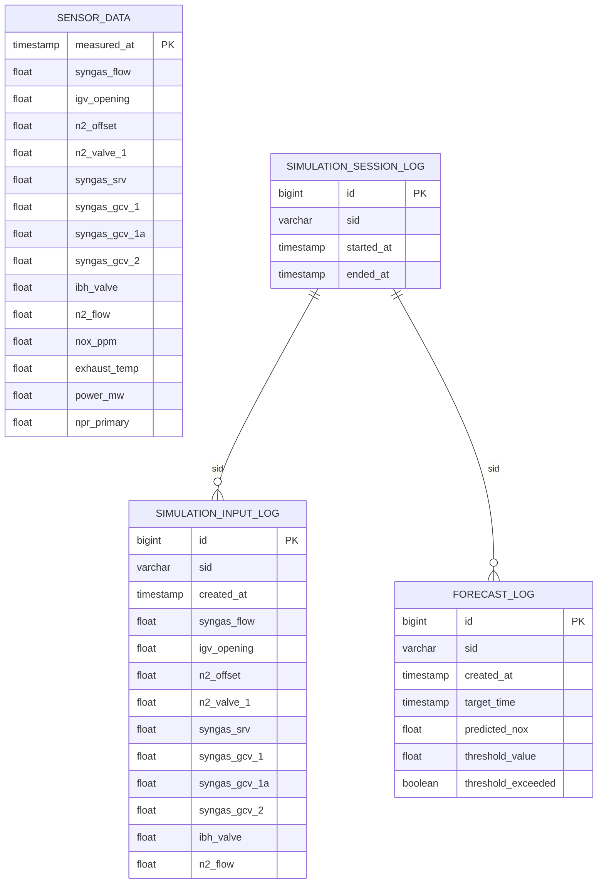

# DB 변경 요청서 — PR #35 / #36 / #37 / #38 반영

> 작성일: 2026-05-11
> 대상 PR: #35 (DT ControlVars 10 확장) · #36 (백엔드 새 스펙 정렬) · #37 (DT v2 1분 앙상블) · #38 (HMI + 백엔드 연동 정리)
> 기준 문서: `NOxO_Project_Repo/database/db_definition.md` v1.2
> 목적: 위 4개 PR로 확정된 새 스펙(제어 10변수 · 출력 4변수 · 1분 집계 모델 · 5분 Forecaster)을 DB에 반영하기 위해 필요한 변경 사항 정리.

---

## 0. 요약 — 한 페이지 체크리스트

> ⚠️ **컬럼명 협의 필요**: 본 문서에 제안된 모든 신규/개명 컬럼명(`igv_opening`, `n2_offset`, `n2_flow`, `power_mw`, `n2_valve_1`, `syngas_srv`, `syngas_gcv_1/1a/2`, `ibh_valve`, `exhaust_temp` 등)은 **DB 담당과 협의 후 확정**한다. 아래 표·DDL·매핑은 협의 전 초안이며, 확정안에 따라 일괄 갱신한다.

| # | 변경 항목 | 영향 테이블 | 우선순위 | 비고 |
|---|---|---|---|---|
| 1 | `sensor_data` 컬럼 14개(제어 10 + 출력 4)로 재정의 | `sensor_data` | P1 (블로커) | 적재 스크립트와 함께 동시 변경 · **컬럼명 협의 필요** |
| 2 | 신규 7개 제어 태그 적재 추가 (FSAGR / FSAG11 / FSAG11A / FSAG12 / nicvs1 / CSBHX / TTXM) | `sensor_data` | P1 (블로커) | 원천 CSV에 이미 존재 — 매핑만 확장 · **컬럼명 협의 필요** |
| 3 | `threshold_config` 테이블 **삭제 (drop)** | `threshold_config` | P2 | PR #38에서 백엔드 ORM/repo 이미 제거됨. DT config가 SoT |
| 4 | `simulation_session_log` 신규 생성 | (신규) | P2 | 백엔드 in-memory 세션의 영속화. 현재는 옵션 |
| 5 | `simulation_input_log` 신규 생성 — 10필드로 정의 | (신규) | P2 | 기존 ERD의 2필드(dgan_offset/igv) → 10필드 확장 |
| 6 | `forecast_log` 신규 생성 (구 `prediction_log` 재정의) | (신규) | P2 | 5분 horizon 고정 → `target_minutes` 컬럼 제거 |
| 7 | `sensor_data_1min` 1분 집계 뷰/물리테이블 추가 (선택) | (신규) | P3 | PR #37 모델 입력 — 운영 시 1초 → 1분 집계 필요 |
| 8 | `co_ppm` 관련 컬럼/지표 일체 미생성 | n/a | P1 (확인) | OutputVars에서 `co` 제거됨. 향후에도 적재 금지 |
| 9 | `npr_primary` / `ambient_temp` 컬럼 처리 결정 필요 | `sensor_data` | P2 (협의) | 새 ControlVars 10에 포함 안 됨. 피처로 살릴지 폐기할지 결정 |
| 10 | ERD 다이어그램 갱신 | `NOxO_Project_Repo/database/ERD.png` | P2 | 위 변경 머지 후 일괄 갱신 |

---

## 1. 배경 — 무엇이 왜 바뀌었나

### 1.1 PR #35 — DT ControlVars 3 → 10 확장
- DT `ControlVars`가 회의 결정에 따라 합성가스 발전 설비 제어 변수 **10개**로 확장됨.
- 기존 3개(`syngas_flow`, `igv_opening`, `n2_offset`) + 신규 7개.
- 단일 진실원: `NOxO_Project_Repo/digital_twin/simulation/state.py` `ControlVars` dataclass.

### 1.2 PR #35 — OutputVars `co` 제거
- `co` (CO 농도)는 학습 타겟에서 제외(`NOxO_Project_Repo/docs/REFACTOR_FLAME_TEMP_TO_EXHAUST_TEMP.md`).
- 출력 변수는 **nox / exhaust_temp / power / lambda_ / efficiency** 5개. 단, `lambda_` 와 `efficiency` 는 파생(즉시 계산)값.

### 1.3 PR #36 — Simulator / Forecaster 어댑터 분리
- `prediction_service` → `forecast_service` 로 개명, **horizon 5분 고정**.
- `target_minutes` 필드 제거됨 (`NOxO_Project_Repo/apps/backend/app/schemas/prediction.py`).
- 백엔드는 두 어댑터를 별도 DI 슬롯으로 보유: Simulator(실시간 시뮬) · Forecaster(5분 예측).

### 1.4 PR #37 — 1분 집계 + Ridge·LGB 앙상블
- 학습/추론이 **1분 집계 데이터** 기반으로 전환됨 (1초 데이터의 자기상관/노이즈 제거).
- 추론 시 입력으로 "최근 1초 시계열 60+행"이 필요. 즉 실시간 운영에서도 1초 raw 보존 필수.
- 파생 피처: NQJ lag×3, TTXM lag/rolling×3, NPR×4 — **TTXM (배기온도) 컬럼이 모델 입력으로 반드시 존재해야 함**.

### 1.5 PR #38 — 운영 임계 단일 진실원화
- `threshold_config` DB 모델 / repo 삭제됨.
- 임계값은 `NOxO_Project_Repo/digital_twin/simulation/config.py` `ThresholdConfig` 가 SoT.
- 프론트는 `GET /api/threshold` 1회 호출로 9개 필드 일괄 수신.

---

## 2. 운영 테이블 `sensor_data` 변경

### 2.1 현재 정의 (db_definition.md v1.1 §2)

핵심 9개 컬럼:
```
measured_at (PK) | nox_ppm | dgan_offset | syngas_flow | generator_output |
npr_primary | ambient_temp | dgan_flow | igv
```

### 2.2 새 스펙 매핑 — 운영 14개 컬럼 (제어 10 + 출력 4)

> **명명 규칙 (협의 필요)**: 아래 컬럼명은 DT/백엔드 도메인 식별자(`digital_twin/simulation/state.py`, `apps/backend/app/domain/tags.py`)를 그대로 운영 컬럼명으로 사용한 **초안**이다. 실제 컬럼명은 **DB 담당과 협의 후 확정**한다. ETL 호환을 위해 기존 컬럼명도 alias 로 한 사이클 유지 가능.

#### 제어 변수 10개 (DT ControlVars · 백엔드 ControlPayload)

| 원본 TagName (CSV) | 신규 DB 컬럼명 | 데이터 타입 | 논리명 | 기존 컬럼 (있다면) |
| :--- | :--- | :--- | :--- | :--- |
| `IGCC.CC.G1.ca_fqsg_cl` | `syngas_flow` | FLOAT | 합성가스 유량 | `syngas_flow` (유지) |
| `IGCC.CC.G1.csgv` | `igv_opening` | FLOAT | IGV 개도 [%] | `igv` (**개명**) |
| `IGCC.CC.G1.NQKR3_MONITOR` | `n2_offset` | FLOAT | N2 오프셋 | `dgan_offset` (**개명**) |
| `IGCC.CC.G1.nicvs1` | `n2_valve_1` | FLOAT | N2 주입 제어밸브 #1 개도 [%] | **신규** |
| `IGCC.CC.G1.FSAGR` | `syngas_srv` | FLOAT | Syngas SRV(VSR-11) 개도 [%] | **신규** |
| `IGCC.CC.G1.FSAG11` | `syngas_gcv_1` | FLOAT | Syngas GCV #1 개도 [%] | **신규** |
| `IGCC.CC.G1.FSAG11A` | `syngas_gcv_1a` | FLOAT | Syngas GCV #1A 개도 [%] | **신규** |
| `IGCC.CC.G1.FSAG12` | `syngas_gcv_2` | FLOAT | Syngas GCV #2 개도 [%] | **신규** |
| `IGCC.CC.G1.CSBHX` | `ibh_valve` | FLOAT | IBH 입구 가열 제어밸브 개도 [%] | **신규** |
| `IGCC.CC.G1.NQJ` | `n2_flow` | FLOAT | N2 주입 유량 | `dgan_flow` (**개명**) |

#### 출력/관측 변수 4개 (모델 타깃 · WS 스트림)

| 원본 TagName (CSV) | 신규 DB 컬럼명 | 데이터 타입 | 논리명 | 기존 컬럼 |
| :--- | :--- | :--- | :--- | :--- |
| `IGCC.DeNOX.AT_H1_901_PV` | `nox_ppm` | FLOAT | NOx 농도 (Target) | `nox_ppm` (유지) |
| `IGCC.CC.G1.TTXM` | `exhaust_temp` | FLOAT | 배기가스 온도 (모델 입력 + 타깃) | **신규** |
| `IGCC.CC.G1.DWATT` | `power_mw` | FLOAT | 발전기 출력 [MW] | `generator_output` (**개명**) |
| `IGCC.CC.G1.VNPR_P` | `npr_primary` | FLOAT | NPR Primary (파생 피처용) | `npr_primary` (유지) |

#### 메타

| 컬럼 | 타입 | 비고 |
| :--- | :--- | :--- |
| `measured_at` | TIMESTAMP (PK) | 기존 유지 |

### 2.3 변경 요지

> ⚠️ 아래 컬럼명은 **협의 필요** — DB 담당 확정 전 초안.

- **컬럼 명 표준화** (백엔드 도메인 ↔ DB 일치):
  - `igv` → `igv_opening`
  - `dgan_offset` → `n2_offset`
  - `dgan_flow` → `n2_flow`
  - `generator_output` → `power_mw`
- **신규 컬럼 7개 추가**: `n2_valve_1`, `syngas_srv`, `syngas_gcv_1`, `syngas_gcv_1a`, `syngas_gcv_2`, `ibh_valve`, `exhaust_temp`
- **유지**: `measured_at`, `nox_ppm`, `syngas_flow`, `npr_primary`
- **결정 필요 (P2)**: `ambient_temp`(`IGCC.CC.G1.ATID`) — 신규 ControlVars/OutputVars 둘 다에 없음. 보조 피처로 살릴지 폐기할지 협의 필요.

### 2.4 DDL 초안 (PostgreSQL 15)

> ⚠️ 컬럼명은 **DB 담당과 협의 후 확정**. 아래 DDL은 협의용 초안.

```sql
-- 14 컬럼 신규 스키마 (운영 sensor_data) — 컬럼명 협의 필요
CREATE TABLE IF NOT EXISTS sensor_data (
    measured_at      TIMESTAMP PRIMARY KEY,

    -- 제어 변수 (ControlVars 10)
    syngas_flow      DOUBLE PRECISION NOT NULL,
    igv_opening      DOUBLE PRECISION NOT NULL,
    n2_offset        DOUBLE PRECISION NOT NULL,
    n2_valve_1       DOUBLE PRECISION NOT NULL,
    syngas_srv       DOUBLE PRECISION NOT NULL,
    syngas_gcv_1     DOUBLE PRECISION NOT NULL,
    syngas_gcv_1a    DOUBLE PRECISION NOT NULL,
    syngas_gcv_2     DOUBLE PRECISION NOT NULL,
    ibh_valve        DOUBLE PRECISION NOT NULL,
    n2_flow          DOUBLE PRECISION NOT NULL,

    -- 출력/관측 변수
    nox_ppm          DOUBLE PRECISION NOT NULL,
    exhaust_temp     DOUBLE PRECISION NOT NULL,
    power_mw         DOUBLE PRECISION NOT NULL,
    npr_primary      DOUBLE PRECISION NOT NULL
);

CREATE INDEX IF NOT EXISTS idx_sensor_data_measured_at
    ON sensor_data (measured_at DESC);
```

### 2.5 ETL 스크립트 영향 — `NOxO_Project_Repo/database/load_to_postgres.py`

`COLUMN_MAPPING` dict 를 다음으로 교체해야 함:

```python
COLUMN_MAPPING = {
    "TagName":                       "measured_at",
    # 제어 변수 10
    "IGCC.CC.G1.ca_fqsg_cl":         "syngas_flow",
    "IGCC.CC.G1.csgv":               "igv_opening",
    "IGCC.CC.G1.NQKR3_MONITOR":      "n2_offset",
    "IGCC.CC.G1.nicvs1":             "n2_valve_1",
    "IGCC.CC.G1.FSAGR":              "syngas_srv",
    "IGCC.CC.G1.FSAG11":             "syngas_gcv_1",
    "IGCC.CC.G1.FSAG11A":            "syngas_gcv_1a",
    "IGCC.CC.G1.FSAG12":             "syngas_gcv_2",
    "IGCC.CC.G1.CSBHX":              "ibh_valve",
    "IGCC.CC.G1.NQJ":                "n2_flow",
    # 출력/관측 4
    "IGCC.DeNOX.AT_H1_901_PV":       "nox_ppm",
    "IGCC.CC.G1.TTXM":               "exhaust_temp",
    "IGCC.CC.G1.DWATT":              "power_mw",
    "IGCC.CC.G1.VNPR_P":             "npr_primary",
}
```

`validate_sensor_data()` 의 NULL 체크 SUM 절도 새 14개 컬럼으로 갱신해야 함.

---

## 3. `threshold_config` 테이블 — **삭제**

### 3.1 사유
- PR #38에서 백엔드 ORM (`apps/backend/app/db/models/threshold_config.py`) · repo · service 모두 삭제됨.
- 새 `ThresholdService`는 `digital_twin/simulation/config.py` 의 `ThresholdConfig` 를 직접 읽어 9개 필드를 응답.
- DB에 별도 테이블을 유지할 운영상 이유 없음 (코드 배포가 곧 임계값 반영).

### 3.2 작업
```sql
DROP TABLE IF EXISTS threshold_config;
```

> 운영 DB에 이미 데이터가 적재되어 있다면, drop 전에 마지막 스냅샷을 백업 권장.

### 3.3 향후 재도입 조건 (참고)
- 코드 배포 없이 운영자가 GUI에서 임계값을 조정해야 하는 요구사항이 생긴다면 그 시점에 재설계 (이때 `effective_from/effective_to` 기반 시계열 테이블로 부활).

---

## 4. 신규 세션/예측 로그 테이블 (P2 — 백엔드 영속화 시점)

> 현재 백엔드는 in-memory state store 만 사용하고 있어 DB 테이블이 즉시 필요하진 않지만, 후속 PR 에서 영속화 시 아래 정의로 합의해 두면 협업 비용을 줄일 수 있습니다.

### 4.1 `simulation_session_log`

```sql
CREATE TABLE IF NOT EXISTS simulation_session_log (
    id           BIGSERIAL PRIMARY KEY,
    sid          VARCHAR(64) NOT NULL UNIQUE,
    started_at   TIMESTAMP NOT NULL,
    ended_at     TIMESTAMP,
    -- mode 필드는 PR #38에서 startSession 페이로드에서 제거됨. 컬럼 미추가.
    notes        TEXT
);

CREATE INDEX IF NOT EXISTS idx_session_started ON simulation_session_log (started_at DESC);
```

기존 ERD 의 `mode` 컬럼 **제거** (PR #38 — 프론트 `startSession`에서 사용처 없는 `mode` 필드 제거됨).

### 4.2 `simulation_input_log` — 10필드 제어 변수 로그

```sql
CREATE TABLE IF NOT EXISTS simulation_input_log (
    id            BIGSERIAL PRIMARY KEY,
    sid           VARCHAR(64) NOT NULL REFERENCES simulation_session_log(sid),
    created_at    TIMESTAMP NOT NULL DEFAULT CURRENT_TIMESTAMP,

    -- ControlVars 10필드 그대로
    syngas_flow   DOUBLE PRECISION NOT NULL,
    igv_opening   DOUBLE PRECISION NOT NULL,
    n2_offset     DOUBLE PRECISION NOT NULL,
    n2_valve_1    DOUBLE PRECISION NOT NULL,
    syngas_srv    DOUBLE PRECISION NOT NULL,
    syngas_gcv_1  DOUBLE PRECISION NOT NULL,
    syngas_gcv_1a DOUBLE PRECISION NOT NULL,
    syngas_gcv_2  DOUBLE PRECISION NOT NULL,
    ibh_valve     DOUBLE PRECISION NOT NULL,
    n2_flow       DOUBLE PRECISION NOT NULL
);

CREATE INDEX IF NOT EXISTS idx_sim_input_sid_created ON simulation_input_log (sid, created_at DESC);
```

기존 ERD 의 2필드(`dgan_offset`, `igv`) → 10필드로 확장. 컬럼명은 §2.2 와 동일한 도메인 식별자 사용.

### 4.3 `forecast_log` — 5분 horizon 예측 로그 (구 `prediction_log` 재정의)

```sql
CREATE TABLE IF NOT EXISTS forecast_log (
    id                 BIGSERIAL PRIMARY KEY,
    sid                VARCHAR(64) REFERENCES simulation_session_log(sid),
    created_at         TIMESTAMP NOT NULL DEFAULT CURRENT_TIMESTAMP,
    target_time        TIMESTAMP NOT NULL,           -- created_at + 5분
    predicted_nox      DOUBLE PRECISION NOT NULL,
    threshold_value    DOUBLE PRECISION NOT NULL,    -- 예측 시점의 nox_ppm_limit
    threshold_exceeded BOOLEAN NOT NULL
);

CREATE INDEX IF NOT EXISTS idx_forecast_sid_created ON forecast_log (sid, created_at DESC);
```

변경점:
- 테이블명 `prediction_log` → `forecast_log` (PR #36 어댑터/서비스 명명과 일치).
- `target_minutes` 컬럼 **제거** (PR #36 — horizon 5분 고정).
- `threshold_value` 컬럼 추가 — 시점별 임계값 스냅샷 보존 (감사 추적용).

---

## 5. `sensor_data_1min` — 1분 집계 테이블/뷰 (P3, 선택)

### 5.1 사유 (PR #37)
- 신규 ML 모델은 1분 집계 데이터로 학습됨. `predict()` 도 최근 1초 시계열 60+행을 받아 내부에서 1분 집계 후 추론.
- 운영 단계에서 1초 raw → 1분 집계를 매번 DB 측에서 계산하는 비용을 줄이려면 materialized view 또는 별도 테이블 유지를 검토할 수 있음.

### 5.2 옵션 A — Materialized View

```sql
CREATE MATERIALIZED VIEW IF NOT EXISTS sensor_data_1min AS
SELECT
    date_trunc('minute', measured_at) AS measured_at,
    AVG(syngas_flow)    AS syngas_flow,
    AVG(igv_opening)    AS igv_opening,
    AVG(n2_offset)      AS n2_offset,
    AVG(n2_valve_1)     AS n2_valve_1,
    AVG(syngas_srv)     AS syngas_srv,
    AVG(syngas_gcv_1)   AS syngas_gcv_1,
    AVG(syngas_gcv_1a)  AS syngas_gcv_1a,
    AVG(syngas_gcv_2)   AS syngas_gcv_2,
    AVG(ibh_valve)      AS ibh_valve,
    AVG(n2_flow)        AS n2_flow,
    AVG(nox_ppm)        AS nox_ppm,
    AVG(exhaust_temp)   AS exhaust_temp,
    AVG(power_mw)       AS power_mw,
    AVG(npr_primary)    AS npr_primary
FROM sensor_data
GROUP BY date_trunc('minute', measured_at);

CREATE UNIQUE INDEX IF NOT EXISTS idx_sensor_1min_measured
    ON sensor_data_1min (measured_at);
```

`REFRESH MATERIALIZED VIEW sensor_data_1min` 주기는 운영 시 Airflow DAG 로 관리 권장.

### 5.3 옵션 B — Airflow DAG 로 별도 테이블 적재
- `NOxO_Project_Repo/airflow/` 에 1분 집계 DAG 추가.
- 모델 재학습 파이프라인에서 직접 소비.

> **결정 필요**: A/B 선택 — 운영 DB 부하 분포에 따라 결정.

---

## 6. ERD 갱신 (P2)

§2~§4 반영 후 `NOxO_Project_Repo/database/ERD.png` 와 `NOxO_Project_Repo/database/db_definition.md` 의 mermaid 블록을 동시 갱신.

새 ERD 개요:



`THRESHOLD_CONFIG` 엔티티 삭제.

---

## 7. 마이그레이션 절차 권장안

> 운영 DB(`igcc_db`)에 이미 1.2M 행이 적재되어 있는 상태를 가정.

### 7.1 단계 (P1)

1. **백업**: `pg_dump igcc_db > backup_$(date +%F).sql`.
2. **스키마 마이그레이션 — `sensor_data`**:
   ```sql
   -- 컬럼 추가 (NULL 허용으로 추가 후 적재 → NOT NULL 으로 변경)
   ALTER TABLE sensor_data
       ADD COLUMN n2_valve_1     DOUBLE PRECISION,
       ADD COLUMN syngas_srv     DOUBLE PRECISION,
       ADD COLUMN syngas_gcv_1   DOUBLE PRECISION,
       ADD COLUMN syngas_gcv_1a  DOUBLE PRECISION,
       ADD COLUMN syngas_gcv_2   DOUBLE PRECISION,
       ADD COLUMN ibh_valve      DOUBLE PRECISION,
       ADD COLUMN exhaust_temp   DOUBLE PRECISION;

   -- 기존 컬럼 개명 (도메인 식별자 일치)
   ALTER TABLE sensor_data RENAME COLUMN igv               TO igv_opening;
   ALTER TABLE sensor_data RENAME COLUMN dgan_offset       TO n2_offset;
   ALTER TABLE sensor_data RENAME COLUMN dgan_flow         TO n2_flow;
   ALTER TABLE sensor_data RENAME COLUMN generator_output  TO power_mw;
   ```
3. **`ambient_temp` 처리 결정** (§2.3 P2) — 폐기 시 `ALTER TABLE sensor_data DROP COLUMN ambient_temp;`.
4. **데이터 재적재**:
   - `NOxO_Project_Repo/database/load_to_postgres.py` 의 `COLUMN_MAPPING` 갱신 후 (§2.5) 재실행.
   - 신규 7개 컬럼은 원천 CSV 의 해당 태그를 읽어 채움.
5. **NOT NULL 적용**:
   ```sql
   ALTER TABLE sensor_data
       ALTER COLUMN n2_valve_1     SET NOT NULL,
       ALTER COLUMN syngas_srv     SET NOT NULL,
       ALTER COLUMN syngas_gcv_1   SET NOT NULL,
       ALTER COLUMN syngas_gcv_1a  SET NOT NULL,
       ALTER COLUMN syngas_gcv_2   SET NOT NULL,
       ALTER COLUMN ibh_valve      SET NOT NULL,
       ALTER COLUMN exhaust_temp   SET NOT NULL;
   ```
6. **`threshold_config` 삭제**: `DROP TABLE IF EXISTS threshold_config;`.

### 7.2 검증
- `SELECT COUNT(*) FROM sensor_data;` 가 기존 행수(1,209,599) 와 동일한지.
- `SELECT measured_at FROM sensor_data ORDER BY measured_at LIMIT 1` / `... DESC LIMIT 1` 로 적재 범위 재확인.
- 백엔드 통합 테스트 — `pytest apps/backend/` 29개 통과.

### 7.3 후속 단계 (P2/P3)
- §4 (`simulation_session_log` / `simulation_input_log` / `forecast_log`) 는 백엔드 영속화 PR 과 동시 머지.
- §5 (`sensor_data_1min`) 은 Airflow DAG 가 준비된 시점에 도입.

---

## 8. 결정 필요 사항 — 팀 협의 포인트

| ID | 항목 | 옵션 | 권장 |
|---|---|---|---|
| Q0 | **신규/개명 컬럼명 확정** (§2.2 표 14종 전체) | (A) 본 문서 초안 그대로 채택 / (B) DB 담당 제안으로 일괄 치환 / (C) 일부만 변경 | **DB 담당과 협의 후 확정** — 확정안에 따라 §2 / §4 / §5 / §6 / ETL `COLUMN_MAPPING` 일괄 갱신 |
| Q1 | `ambient_temp` (`IGCC.CC.G1.ATID`) — 새 스펙엔 없음 | (A) 컬럼 유지·피처 후보로 보존 / (B) 폐기 | **(B) 폐기** — 모델 입력에서 빠진 상태이고 ControlVars/OutputVars에도 없음. 필요해지면 그때 재추가 |
| Q2 | 기존 컬럼 개명 시 alias 유지 기간 | (A) 즉시 교체 / (B) 1주일 alias 병행 | (B) — 분석/리포트 노트북이 옛 이름을 쓰고 있으면 충격 완화 |
| Q3 | `sensor_data_1min` 운영 — Materialized View vs Airflow DAG | A/B | 운영 부하 측정 후 결정 |
| Q4 | `simulation_*_log` 영속화 시점 | (A) 다음 스프린트 / (B) 데모 후 | (B) — 데모 시점엔 in-memory 로도 충분 |
| Q5 | `npr_primary` 향후 컬럼 유지 여부 | (A) 유지 (파생 피처 NPR×4) / (B) 폐기 | (A) — PR #37 파생 피처가 이미 사용 |

---

## 9. 참고 — 소스 단일 진실원 매핑

| 도메인 | 파일 경로 |
| :--- | :--- |
| ControlVars 10필드 정의 | `NOxO_Project_Repo/digital_twin/simulation/state.py` |
| OutputVars 5필드 정의 | `NOxO_Project_Repo/digital_twin/simulation/state.py` |
| IGCC 태그 매핑 + 운영 한계 | `NOxO_Project_Repo/apps/backend/app/domain/tags.py` |
| 운영 임계 (ThresholdConfig) | `NOxO_Project_Repo/digital_twin/simulation/config.py` |
| WS Stream 메시지 | `NOxO_Project_Repo/apps/backend/app/schemas/stream.py` |
| Snapshot/Session 스키마 | `NOxO_Project_Repo/apps/backend/app/schemas/session.py` |
| Forecast 5분 스키마 | `NOxO_Project_Repo/apps/backend/app/schemas/prediction.py` |
| 1분 집계 ML 모델 | `NOxO_Project_Repo/digital_twin/train.py`, `NOxO_Project_Repo/digital_twin/predict.py`, `NOxO_Project_Repo/digital_twin/preprocess.py` |
| 현행 ETL 스크립트 | `NOxO_Project_Repo/database/load_to_postgres.py` |
| 기존 DB 정의서 | `NOxO_Project_Repo/database/db_definition.md` |
| 현행 ERD 다이어그램 | `NOxO_Project_Repo/database/ERD.png` |

---

## 10. 후속 작업 체크리스트

- [ ] **§2 신규/개명 컬럼명 DB 담당과 협의·확정** (Q0) — 확정 전까지 아래 후속 작업 착수 금지
- [ ] §2 `sensor_data` DDL 합의 + 마이그레이션 스크립트 작성
- [ ] §2.5 `load_to_postgres.py` `COLUMN_MAPPING` / `validate_sensor_data` 갱신 PR
- [ ] §3 `threshold_config` 테이블 drop 실행
- [ ] §4 세션/예측 로그 테이블 — 백엔드 영속화 PR 시점에 합류
- [ ] §5 1분 집계 옵션 A/B 결정 후 구현
- [ ] §6 `db_definition.md` v1.2 갱신 + ERD 재생성
- [ ] §8 Q1~Q5 결정 회의록 정리 (`NOxO_Project_Repo/docs/` 에 첨부)
